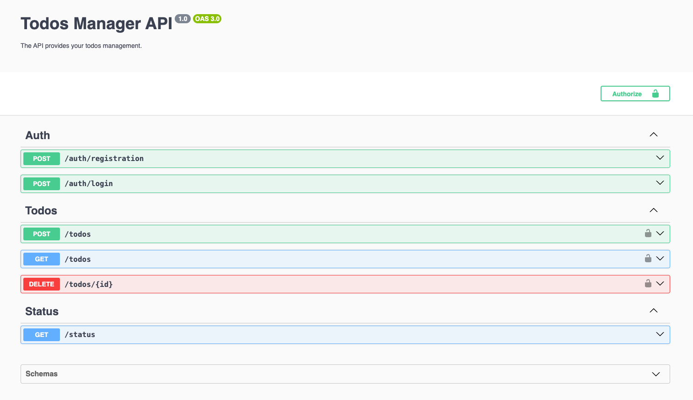

# Todos Manager API

## Prerequisites
### Database
PostgreSQL database is required to run the application. You can use the docker-compose file to run it.
Go to `./database-docker` directory and run `docker-compose up` to start the database (it requires [docker](https://docs.docker.com/) installed on your machine).

### Environment variables
The app uses [dotenv](https://github.com/motdotla/dotenv) configuration.
You may provide your own `.env` file in this directory or use the default values from the code.
See `.env.example` to see an example `.env` file with all supported variables.
The default values for the database use credentials from `./database-docker/docker-compose.yml`, so no need to create or modify any file for development.


## Dependencies installation

```bash
$ npm install
```

## Running the app

```bash
# development
$ npm run start

# watch mode
$ npm run start:dev


# build for production
$ npm run build

# run built production files
$ npm run start:prod
```

## Run in docker
A single command to install dependencies, build, and run the app in a [docker](https://docs.docker.com/) container.
`./Dockerfile` is designed to use it from `../docker-compose.yml` with the whole setup (see more in [../README.md](../README.md)).
It copies `./.env.docker-compose` to the container to use `postgres` as the database host instead of `localhost`.
So, you need to remove line `COPY .env.docker-compose .env` from `Dockerfile` to use it without the full docker-compose.
```bash
$ docker build -t todos-manager-api . && docker run --rm -p 3000:3000 todos-manager-api
```
Visit `http://localhost:3000` in your browser.

## Test

```bash
# unit tests
$ npm run test

# e2e tests
$ npm run test:e2e

# test coverage
$ npm run test:cov
```

## Lint

```bash
$ npm run lint
```

See `package.json` for more commands.


## Development

### Project structure
The project is modularized to separate concerns and to be scalable. You may find the following modules:
- `src/auth` - authentication and authorization
- `src/users` - user management
- `src/todos` - todo items management
- `src/status` - health check endpoint required by any container platform like k8s
Other directories are:
- `src/common` - shared code like error DTO
- `src/config` - dotenv and typeorm configuration
- `src/database-migrations` - typeorm migrations to update the database schema (more in the next section)
- `test` - end-to-end tests

### Database migrations

- To create a new migration, run the following command (replace `MigrationName`):
```
$ npm run migration:create -- ./src/database-migrations/MigrationName
```

Migrations are applied automatically on the app start.

- Running manually:
```
$ npm run migration:run 
```

- Reverting the last migration:
```
$ npm run migration:revert 
```

See more details in [typeorm docs](https://typeorm.io/migrations).

### OpenAPI

The app uses [NestJS Swagger](https://docs.nestjs.com/openapi/introduction) to generate OpenAPI documentation.
It is available at root (`/`) endpoint. It's configured to support all endpoints, including security.



