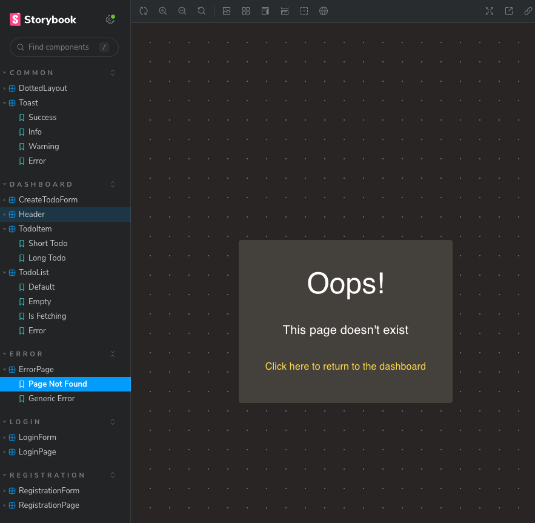

# Todos Manager Frontend

## Prerequisites

### Environment variables
The app uses [dotenv](https://github.com/motdotla/dotenv) configuration.
You may provide your own `.env` file in this directory or use the default values from the code.
See `.env.example` to see an example `.env` file with all supported variables.
The default value for the API URL uses the default API port for convenience.

### API
See the [API README](../api/README.md) for the API running docs.

## Dependencies installation

```bash
$ npm install
```

## Running the app

```bash
# development (the browser will open automatically)
$ npm run start:dev

# production build
$ npm run build
```

## Run in docker
A single command to install dependencies, build, and run the app in a docker container.
It uses `nginx` to serve the static files.
All you need is [docker](https://docs.docker.com/) installed on your machine and then run:
```bash
$ docker build -t todos-manager-frontend . && docker run --rm -p 8080:80 todos-manager-frontend
```
Visit `http://localhost:8080` in your browser.

## Test

```bash
$ npm run test
```

## E2E tests
End-to-end tests are implemented with [cypress](https://www.cypress.io/) in `cypress/` directory.
There are no mocks, so the tests check user interactions against a real system.
They require a running frontend at the default dev port (`5173`) that has a connection to a running backend.
Running `docker-compose up` in the repo main directory will be enough, but you need to set the base url to http://localhost:8080 (nginx port).
See the commands below how to do it.

```bash
# run the tests
$ npm run cypress:test:e2e

# run the tests with a base url matching the docker-compose setup
$ npm run cypress:test:e2e -- --config baseUrl=http://localhost:8080
```

```bash
# open cypress UI to run tests interactively or for development
$ npm run cypress:open
```

## Lint

```bash
$ npm run lint
```

See `package.json` for more commands.


## Development

### Project structure
The project has the following structure:
- `src/api` - API related code like URLs, calling endpoints via HTTP, request/response types
- `src/auth` - authentication related code like saving/reading/parsing JWT, executing login/logout, etc
- `src/common` - reusable components and utilities
- `src/config` - dotenv and route URLs config
- `src/dashboard` - dashboard page with todo items
- `src/error` - error page
- `src/login` - login page
- `src/registration` - registration page
- `cypress` - e2e tests

### I18n
Internationalization is done using `react-intl`.
Currently, it supports English only, but it's ready for more languages.

### Storybook
Use Storybook to see, develop, and test components in isolation.
```bash
$ npm run storybook
```




### UI

A few screenshots from the app:
- Registration page


- Login page


- Dashboard with todo items


